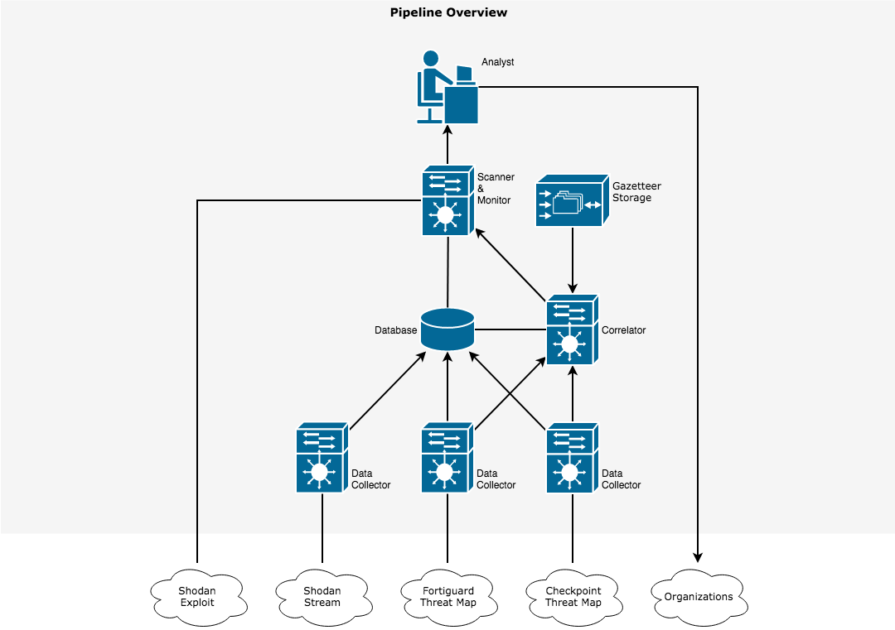

# Armana

Armana aims to become a real-time Internet threat monitor to accelerate incident response.

## Usage

You will need:

* Docker and Docker Compose.
* A Linux computer although theoretically it can run on most hosts.
* (Optional) `pwgen`. Refer to your OS for specific installation instruction.

Basically, to prepare for the services, you need to modify `docker-compose.yml` by either `./prepare.sh -ag` or making `.env` files in `shodan/bot` and `checkpoint/app`, then modifying `docker-compose.yml` accordingly.

You will need to add the following line to `shodan/bot/.env` for using Shodan:

```
API_KEY=<the shodan api key you have>
```

Once everything looks okay, do `docker-compose up` to start up all services. For additional help: `./prepare.sh -h`

## How it works

* The system first attempts to remove anonymity from threat map data by correlating geographical information in Shodan's stream API, various gazetteer and threat map sources.
* It then queries the stream database for server information and then public vulnerability repositories.
* The analyst is responsible for contacting the victim organization for further validation.



## Roadmap

* Automate stuff.
* Meta-Program the heck out of this.
* Make better parser for Shodan's stream.
* Find more threat data source (free or paid?).
* Integrate Google Map API as a gazetteer source.
* Build NLP models to correlate server fingerprints with gazetteers.
* Refine existing machine learning models (KNN and SVM) for correlating Shodan geography with threat map geography.
* Make web app to advertise product and have organizations sign up or opt out.
* Properly license this thing.
* Code cleanup.
* Support for Windows.
* Support for IoT devices.
